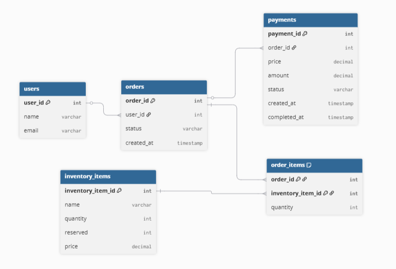

# Autoscale Microservices

MSA система для обработки заказов, платежей, управления складом, пользователями, уведомлениями.

### 1. API Gateway

### 2. Order Service

- `POST /order`
- `GET /order/{id}`
- `GET /order`

### 3. Payment Service

- `POST /payment`
- `GET /payment/{id}`

### 4. External Payment Gateway

- `POST /pay`

### 5. Inventory Service

- `POST /inventory/reserve`
- `POST /inventory/cancel_reserve`
- `GET /inventory/{id}` — наличие товара
- `GET /inventory` — все доступные товары

### 6. User Service

- `POST /user`
- `GET /user/{id}`

### 7. Notification Service

- `POST /notification`

### 8. Analytics Service

Пока в разработке

## Полезные URL

- Eureka: `http://localhost:8761/`
- API Gateway: `http://localhost:8080/api/...`
- Swagger UI: `http://localhost:8088/swagger-ui.html`
- Prometheus metrics: `http://localhost:8088/actuator/prometheus`



## Логика событий

```mermaid

OrderService -->|OrderCreated| InventoryService, NotificationService
OrderService -->|OrderCancelled| InventoryService, NotificationService
OrderService -->|OrderConfirmed| InventoryService, NotificationService
InventoryService -->|ItemReserved| PaymentService
InventoryService -->|ItemReservationFailed| OrderService
PaymentService -->|PaymentStarted| OrderService
PaymentService -->|PaymentConfirmed| OrderService
PaymentService -->|PaymentFailed| OrderService, NotificationService

```
